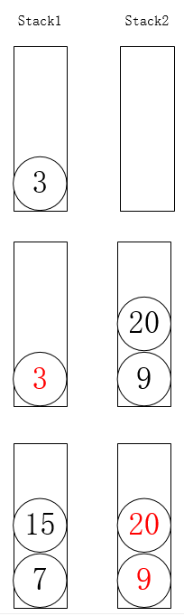

#103、二叉树的锯齿形层次遍历

##题目描述

*给定一个二叉树，返回其节点值的锯齿形层次遍历。（即先从左往右，再从右往左进行下一层遍历，以此类推，层与层之间交替进行）。*

##示例
```
给定二叉树 [3,9,20,null,null,15,7]
    3
   / \
  9  20
    /  \
   15   7

返回锯齿形层次遍历如下：
[
  [3],
  [20,9],
  [15,7]
]
```
##解题思路

用标志位记录当前元素所在层的顺序，关键在于如何保存从右到左的数据，这里选择LinkedList（在链表头部插入，在链表围捕插入都有函数可以直接调用）

```
/**
 * Definition for a binary tree node.
 * public class TreeNode {
 *     int val;
 *     TreeNode left;
 *     TreeNode right;
 *     TreeNode(int x) { val = x; }
 * }
 */
```

1.广度遍历（队）
>https://leetcode-cn.com/problems/binary-tree-zigzag-level-order-traversal/solution/1ms-jian-ji-java-by-wilisuse/

队中保存某一层元素，每一层开始时，计算需要遍历的次数，遍历过程中将下一层的节点加入队中，并移除已经遍历过的节点。
```
class Solution {
    public List<List<Integer>> zigzagLevelOrder(TreeNode root) {
        List<List<Integer>> res = new ArrayList();
        if(root==null){
            return res;
        }
        Queue<TreeNode> queue = new LinkedList<>();
        queue.add(root);
        Boolean flag=false;
        while(!queue.isEmpty()){
            LinkedList<Integer> temp = new LinkedList<>();
            //统计这一层有多少个节点
            int count = queue.size();
            for(int i=0;i<count;i++){
                //遍历每个节点，将其左右子节点加入队列（如果存在）
                //从队列中取出队头
                TreeNode node = queue.poll();
                if (!flag)
                    temp.add(node.val);
                else
                    temp.addFirst(node.val);
                //向队中加入当前节点的左右子节点
                if(node.left!=null){
                    queue.add(node.left);
                }
                if(node.right!=null){
                    queue.add(node.right);
                }
            }      
            res.add(temp);
            flag = !flag;
        }  
        return res;       
    }
}
```

2.深度遍历（递归）
>https://leetcode-cn.com/problems/binary-tree-zigzag-level-order-traversal/solution/die-dai-he-di-gui-by-powcai-3/

通过节点所在层的深度，判断该节点应该插入到哪个层次对应的链表（根据深度信息是奇数还是偶数判断元素位于头部还是尾部）
```
class Solution {
    public List<List<Integer>> zigzagLevelOrder(TreeNode root) {
        List<List<Integer>> res = new ArrayList<>();
        helper(res, root, 0);
        return res;

    }
    //递归
    private void helper(List<List<Integer>> res, TreeNode root, int depth) {
        if (root == null) return;
        if (res.size() == depth) 
            res.add(new LinkedList<>());
        if (depth % 2 == 0) 
            res.get(depth).add(root.val);
        else 
            res.get(depth).add(0, root.val);
        helper(res, root.left, depth + 1);
        helper(res, root.right, depth + 1);
    }
}
```

3.双栈
>https://leetcode-cn.com/problems/binary-tree-zigzag-level-order-traversal/solution/java-1ms-shi-yong-liang-ge-zhan-ji-ke-jie-jue-by-f/<br>

第一个栈从左向右遍历子节点，第二个栈从右往左遍历子节点。

<div align=center>

</div>

```
public static List<List<Integer>> zigzagLevelOrder(TreeNode root) {
        List<List<Integer>> result = new ArrayList<List<Integer>>();
        if(root==null) return result;
        Stack<TreeNode> stack1 = new Stack<TreeNode>();
        Stack<TreeNode> stack2 = new Stack<TreeNode>();
        stack1.push(root);
        while(!stack1.isEmpty()||!stack2.isEmpty()){
        	List<Integer> list = new ArrayList<Integer>();
        	while(!stack1.isEmpty()){
        		TreeNode temp = stack1.pop();
        		list.add(temp.val);
                //注意这里的压栈顺序，先压左子树，再压右子树
        		if(temp.left!=null)
                    stack2.push(temp.left);
        		if(temp.right!=null)
                    stack2.push(temp.right);
        	}
        	if(!list.isEmpty())
                result.add(list);
            list = new ArrayList<Integer>();
        	while(!stack2.isEmpty()){
        		TreeNode temp = stack2.pop();
        		list.add(temp.val);
                //注意这里的压栈顺序，先压右子树，再压左子树
        		if(temp.right!=null)
                    stack1.push(temp.right);
        		if(temp.left!=null)
                    stack1.push(temp.left);
        	}
        	if(!list.isEmpty())result.add(list);
        }
        return result;
    }
}
```
