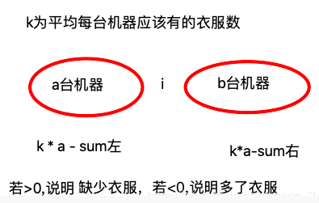

#571、超级洗衣机

##题目描述

*假设有 n 台超级洗衣机放在同一排上。开始的时候，每台洗衣机内可能有一定量的衣服，也可能是空的。在每一步操作中，你可以选择任意 m （1 ≤ m ≤ n） 台洗衣机，与此同时将每台洗衣机的一件衣服送到相邻的一台洗衣机。给定一个非负整数数组代表从左至右每台洗衣机中的衣物数量，请给出能让所有洗衣机中剩下的衣物的数量相等的最少的操作步数。如果不能使每台洗衣机中衣物的数量相等，则返回 -1。*

##示例
```
输入: [1,0,5]
输出: 3

解释: 
第一步:    1     0 <-- 5    =>    1     1     4
第二步:    1 <-- 1 <-- 4    =>    2     1     3    
第三步:    2     1 <-- 3    =>    2     2     2   


输入: [0,3,0]
输出: 2

解释: 
第一步:    0 <-- 3     0    =>    1     2     0    
第二步:    1     2 --> 0    =>    1     1     1     


输入: [0,2,0]
输出: -1

解释: 
不可能让所有三个洗衣机同时剩下相同数量的衣物。
```

##解题思路

1.官网思路<br>
>https://leetcode-cn.com/problems/super-washing-machines/solution/leetcode-chao-ji-xi-yi-ji-by-bittersweet-5/<br>

首先，先分析可以成立的情况，如果 衣服数量%机器总数 != 0，那么无法做到每一台机器都具有相同的衣服；<br>
以机器中的某一个点i为例子进行分析，左边有i-1台机器，右边有size-i台机器，求出k\* (i-1) - sum左和k\*(size-i) - sum右，如果小于0，说明这个区域多了衣服，若大于0，说明这个区域少了衣服；<br>
分类讨论：两边都少了衣服，瓶颈在于两者之和；其它情况的瓶颈都在于两者的绝对值的最大值

<div align=center>

</div>

```
class Solution {
    public int findMinMoves(int[] machines) {
        //特殊参数值处理
        if(machines==null||machines.length==0){
            return -1;
        }
        int length = machines.length;
        int res = 0;
        //记录计算的和
        int sum = 0;
        for(int i=0;i<length;i++){
            sum=sum+machines[i];
        }
        if(sum%length!=0){
            return -1;
        }
        int avg = sum/length;
        int leftsum=0; 
        for(int i=0;i<length;i++){
            //左边与右边的瓶颈值
            int left = avg*i - leftsum;
            int right = avg*(length-i-1)-(sum-leftsum-machines[i]);
            if(left>0&&right>0){
                //两边都少衣服，瓶颈为两者之和
                res = Math.max(res,left+right);
            }
            else{
                //其他情况，瓶颈为较大值
                res = Math.max(res,Math.max(Math.abs(right),Math.abs(left)));
            }            
            leftsum =leftsum+machines[i];            
        }
        return res;
    }

```

2.云栖社区思路<br>
>https://yq.aliyun.com/articles/334311/<br>

举例说明：<br>
有四个洗衣机，装的衣服数为[0, 0, 11, 5]，最终的状态会变为[4, 4, 4, 4]，那么我们将二者做差，得到[-4, -4, 7, 1]，这里负数表示当前洗衣机还需要的衣服数，正数表示当前洗衣机多余的衣服数。我们要做的是要将这个差值数组每一项都变为0，对于第一个洗衣机来说，需要四件衣服可以从第二个洗衣机获得，那么就可以把-4移给二号洗衣机，那么差值数组变为[0, -8, 7, 1]，此时二号洗衣机需要八件衣服，那么至少需要移动8次。然后二号洗衣机把这八件衣服从三号洗衣机处获得，那么差值数组变为[0, 0, -1, 1]，此时三号洗衣机还缺1件，就从四号洗衣机处获得，此时差值数组成功变为了[0, 0, 0, 0]，成功。那么移动的最大次数就是差值数组中出现的绝对值最大的数字，8次。

```
public:
    int findMinMoves(vector<int>& machines) {
        int sum = accumulate(machines.begin(), machines.end(), 0);
        if (sum % machines.size() != 0) return -1;
        int res = 0, cnt = 0, avg = sum / machines.size();
        for (int m : machines) {
            cnt += m - avg;
            res = max(res, max(abs(cnt), m - avg));
        }
        return res;
    }
};
```